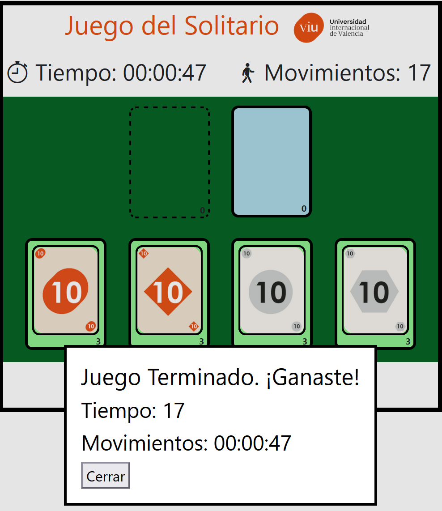

# Actividad 1 - Frontend

## 1 - INTRODUCIÓN

## 2 - DESARROLLO

- Para respetar los nombres dearchivos y directorios recibidos, se agregó un archivo index.html, con un pequeño script que redirige a la página solitario.html.
- No descargamos el archivo favicon.ico de la viu para que sea usado en el juego.
- Decidimos que el desplazamiento de las cartas sea únicamente horizontal ya que queda más prolijo y favorece la jugabilidad en dispositivos con pantallas no muy grandes.
- Se intentó que la interfaz siga siendo amigable antes el cambio del tamaño de pantalla o zoom.
- En solitario.html se crearon los siguientes elementos para reordenar la estructura general:
  -- header: Para contener el título y contadores de tiempo y movimientos.
  -- main: Para contener la propia mesa (aca capaz sobra el div dentro de main).
  -- footer: Para contener El botón de reset
  -- dialog: Para usarlo como mensaje emergente cuando el usuario termina la partida.
- En el html, en algunos casos se utilizaron las clases de bootstrap para posicionar y estilizar elementos.
- Dentro de los tapetes del código "original", que tienen que contener las cartas y el contador, agregamos un div con clase mazo para que sea el encargado de contener las cartas. De esta forma, dentro de los divs con class cartas solo habrán elementos img (carga) y el contador está fuera. Esto para simplificar la obtención y manipulación de las cartas.
- En solitario.css:
  - Estoy viendo div.tapete:not(#inicial) que no se usa.
  - Se creó entre otras, una nueva clase mazo para darle estilo al div.
  - Para generar el desplazamiento de la carta en el mazo inicial se colocal las cartas "normalmente" una al lado de la otra, y se le aplica un márgen izquierdo negativo para que se encime con la carta anterior. Este margen no hay que aplicarlo en la primera carta. Esto se consigue aplicandolo únicamente a las cartas de mazo inicial que tienen otra carta a la izquierda:
  ```
    #mazo-inicial > .carta + .carta {
      margin-left: -60px;
    }
  ```
  - Se aplicó la misma estrategia anterior para lograr que las cartas queden encimadas en los demás mazos, con un márgen negativo igual al ancho de la carta.
  -
- En solitario.js que contiene la lógica propiamente dicha:
  - Se borraron los arrays globales en favor de acceder directamente a la lista de elementos desde el propio DOM y mantener un único listado y no dos en cada caso.
  - Se crearon las constantes globales:
    - NUMERO_INICIAL = permite cambiar desde que número entre 1 y 12 arranca el mazo. Esto para poder poner un número próximo a 12 y probar más rápido el fin del juego y eso.
    - PALO_COLOR: Para cada palo del mazo, indica cual es su color. Al final solo se usa en una función, así que podría estar definido dentro de ella.
  - Se crearon (o cambiaron de nombre) algunas constantes globales para tener acceso permanente a elementos html a los que se acceder desde varias funciones.
  - Cuando se accede a un elemento html desde una única función, se obtiene el elemento dentro de la propia función y no es necesario hacer la constante global.
  - Todas los datos globales (con excepción de temporizar) no tienen razón para cambiar, por lo que se usa const en vez de let.
  - Se mantiene temporizador global, ya que es necesaria para poder limpiar (liberar) el temporizador.
  - Se borró la variable paso y se definió el desplazamiento en el css.
  - La función barajar ejecuta varios sort, porque con uno solo, el mazo no quedaba lo suficientemente desordenado. Pero eso seguro se puede mejorar.
  - Los contadores se setean en base el número de cartas (hijos) que tiene el mazo (div). Por este motivo las funciones incContador y decContador no fueron utilizadas y se borraron en favor de usar siempre setContador.
  - cargarTapeteInicial pasa a ser cargarMazoInicial
  - Se creó la función calcularContadorDeMazos que recibe una lista mazos y recalcula y actualiza todos sus contadores.
  - La función vaciarMazos solo se usa en comenzarJuego, por lo que su contenido podría estar ahí.

## 3 - RESULTADOS



## 4 - CONCLUSIÓN

## 5 - REFERENCIAS

- Documentación de Mozilla: https://developer.mozilla.org
- Documentación de Bootstrap: https://getbootstrap.com/docs/5.3/
- Documentación de Bootstrap Icons: https://icons.getbootstrap.com/
