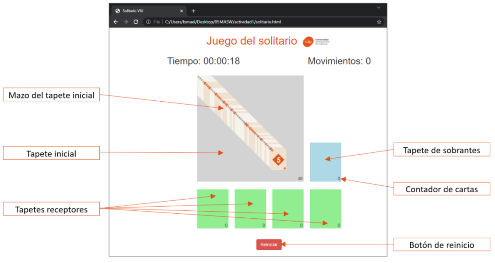

# Actividad 1 - Frontend

## 1 - INTRODUCIÓN

La actividad consiste en implementar una versión elemental del juego del solitario. Respecto a las reglas del juego, hay que tener en cuenta las siguientes consideraciones:

- La baraja de cartas será una baraja VIU, que consiste en:
  - 12 números: 1, 2, 3, 4, 5, 6, 7, 8, 9, 10, 11 y 12
  - 4 palos: "vius", cuadrados, hexágonos y círculos.
- Existirán 6 tapetes (superficies que albergarán mazos de cartas): el tapete inicial, el tapete de
  sobrantes y cuatro tapetes receptores, tal y como puede observarse en la Figura 1, que albergarán
  sendos mazos de cartas a lo largo de la partida.
- El juego consiste en coger la carta de arriba, bien del mazo ubicado en el tapete inicial, bien del tapete de sobrantes, e intentar depositarla en alguno de los mazos de los cuatro tapetes receptores siempre y cuando se cumplan ciertas condiciones.
- El uso de las cartas del mazo de cada tapete es el siguiente:
  - Tapete inicial: conteniendo al principio el mazo completo y barajado aleatoriamente. Las cartas se cogerán por arriba, de una en una. La intención es intentar colocar la carta cogida en alguno de los tapetes receptores siempre y cuando se cumplan ciertas condiciones.
  - Tapete de sobrantes: empleado para depositar temporalmente en su mazo las cartas provenientes del mazo del tapete inicial. Cualquier carta del tapete inicial (siempre y cuando sea la de arriba) se puede depositar en este tapete. Además, la última carta depositada en el mazo de este tapete sirve de fuente alternativa de cartas al mazo del tapete inicial, para intentar depositarla sobre algún mazo de los tapetes receptores en cualquier momento, siempre y cuando se cumplan ciertas reglas tal y como ocurriría si proviniera del mazo del tapete inicial.
  - Cuatro tapetes receptores: donde se irán depositando, sobre los mazos respectivos, las cartas en orden decreciente (comenzará obligatoriamente con el 12 como primera carta y finalizará con la última) y alternando los colores (naranja y gris) en la secuencia de cartas que se van depositando en cada mazo. Una vez depositada una carta en uno de los cuatro tapetes receptores, no se podrá volver a colocar en otro tapete.
- Cuando se agoten las cartas del mazo del tapete inicial, las que queden en el tapete de sobrantes
  serán automáticamente barajadas y dispuestas de nuevo en el tapete inicial, volviendo otra vez a
  comenzar con estas cartas restantes.
- El juego finaliza cuando no queda ninguna carta ni en el tapete inicial ni en el tapete de sobrantes. Cuando ocurra tal situación, se mostrará una ventana de aviso indicando el fin del juego y proporcionando información sobre la partida: el tiempo de juego y la cantidad de movimientos realizados.

En la siguiente figura puede observarse el juego en un supuesto estado inicial.

## 2 - DESARROLLO

## 3 - RESULTADOS

## 4 - CONCLUSIÓN

## 5 - REFERENCIAS

- Documentación de Mozilla: https://developer.mozilla.org
- Documentación de Bootstrap: https://getbootstrap.com/docs/5.3/
- Documentación de Bootstrap Icons: https://icons.getbootstrap.com/
